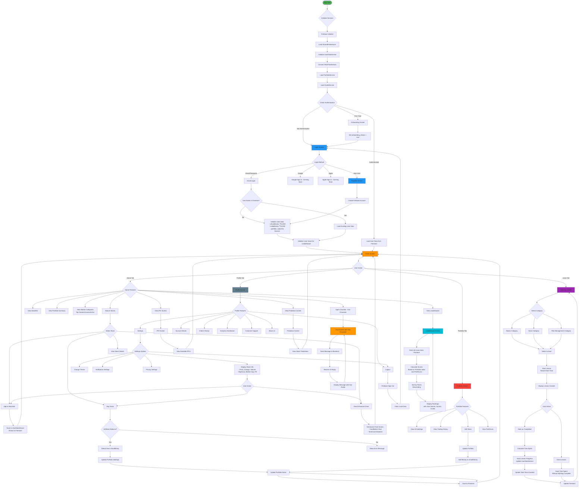
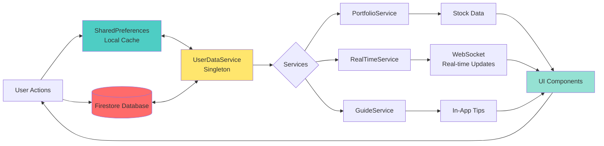
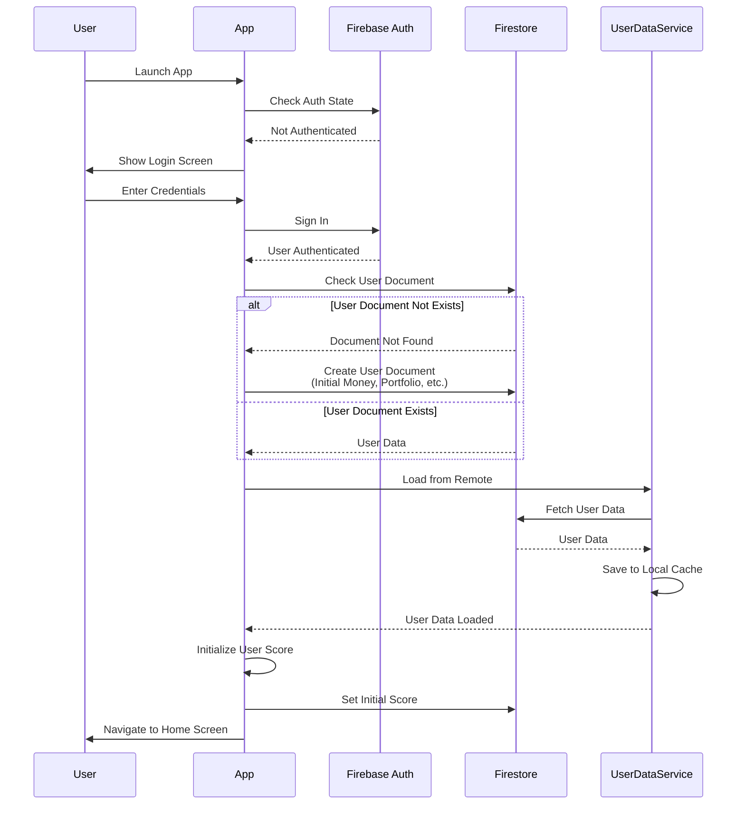
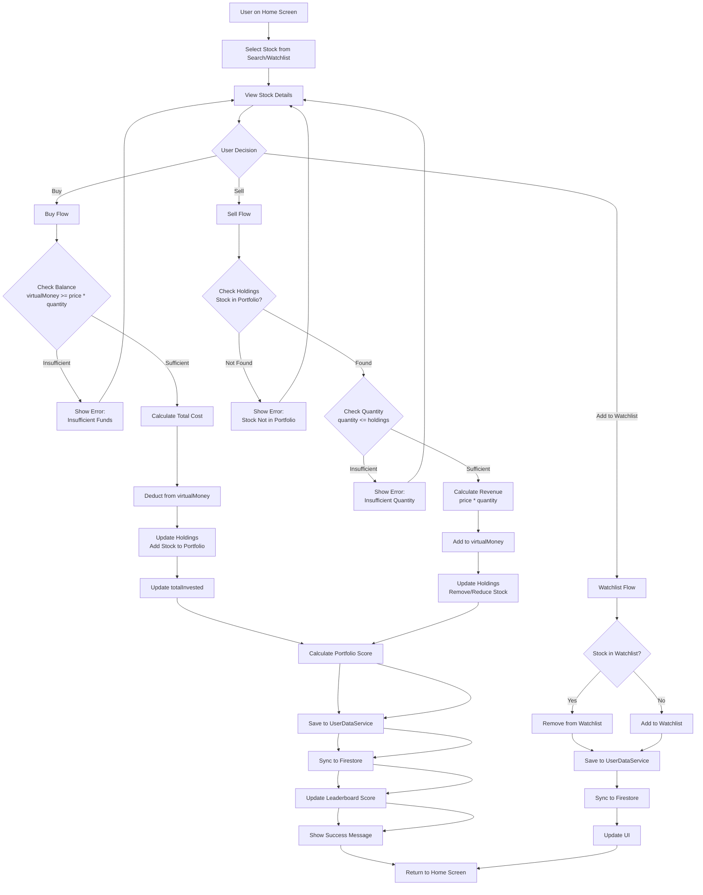
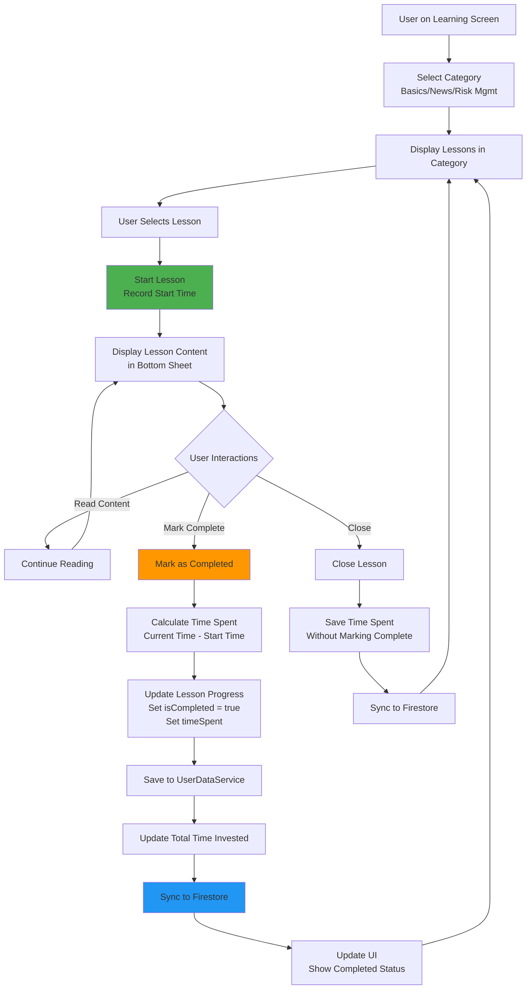

# Investo App - Flowchart Documentation

## Application Flow Diagram

This document contains the complete flow chart for the Investo (StockMaster) application, showing user navigation, data flow, and feature interactions.

## Main Application Flow



## Data Flow Diagram



## Authentication Flow



## Trading Flow



## Learning Center Flow



## Leaderboard Flow

```mermaid
flowchart TD
    User[User Opens Leaderboard] --> FetchUsers[Fetch All Users from Firestore]
    FetchUsers --> ProcessUsers[Process Each User]
    
    ProcessUsers --> CheckData{User Data<br/>Available?}
    CheckData -->|Complete| CalculateMetrics[Calculate Metrics]
    CheckData -->|Incomplete| UseDefaults[Use Default Values<br/>portfolioValue: 0<br/>points: 0<br/>username: 'Unknown']
    
    CalculateMetrics --> GetPortfolioValue[Get Portfolio Value<br/>from currentPrices]
    GetPortfolioValue --> GetProfitLoss[Calculate Profit/Loss<br/>portfolioValue - initialMoney]
    GetProfitLoss --> GetReturnPercent[Calculate Return %<br/>(profitLoss / initialMoney) * 100]
    GetReturnPercent --> CalculatePoints[Calculate Points<br/>portfolioValue + profitLoss<br/>* multiplier]
    CalculatePoints --> GetLevel[Calculate Level<br/>Based on Points]
    
    UseDefaults --> AddUser[Add User to List]
    CalculatePoints --> AddUser
    GetLevel --> AddUser
    
    AddUser --> MoreUsers{More Users?}
    MoreUsers -->|Yes| ProcessUsers
    MoreUsers -->|No| SortUsers[Sort Users<br/>1. By Points (Descending)<br/>2. By Username (Ascending)]
    
    SortUsers --> DisplayLeaderboard[Display Leaderboard]
    DisplayLeaderboard --> ShowTop3[Show Top 3 on Podium]
    DisplayLeaderboard --> ShowList[Show Remaining Users in List]
    
    ShowTop3 --> UpdateUI[Update UI with Rankings]
    ShowList --> UpdateUI
    
    style FetchUsers fill:#2196F3
    style CalculatePoints fill:#FF9800
    style DisplayLeaderboard fill:#4CAF50
```

## Real-time Data Flow

```mermaid
flowchart LR
    RealTimeService[RealTimeService] --> WebSocket[WebSocket Connection<br/>to Finnhub API]
    WebSocket --> ReceiveData[Receive Real-time<br/>Stock Data]
    ReceiveData --> ParseData[Parse Stock Prices]
    ParseData --> UpdateLocalData[Update Local Stock Data]
    UpdateLocalData --> NotifyListeners[Notify UI Listeners]
    NotifyListeners --> UpdateUI[Update UI Components]
    UpdateUI --> UpdatePortfolio[Update Portfolio Value]
    UpdatePortfolio --> UpdateScore[Update Leaderboard Score]
    UpdateScore --> SyncFirestore[Sync to Firestore]
    
    style WebSocket fill:#9C27B0
    style UpdateUI fill:#4CAF50
    style SyncFirestore fill:#F44336
```



## Key Features Summary

### 1. **Authentication & User Management**
   - Firebase Authentication (Email/Password)
   - User registration and login
   - Onboarding for first-time users
   - User data persistence (SharedPreferences + Firestore)

### 2. **Stock Trading**
   - Real-time stock data via WebSocket
   - Stock search and filtering
   - Buy/Sell functionality with virtual money (₹10,000 initial)
   - Portfolio management
   - Watchlist management
   - Stock charts and technical analysis

### 3. **Learning Center**
   - Three categories: Basics, News, Risk Management
   - Lesson tracking with time spent
   - Progress persistence
   - Completion tracking

### 4. **Leaderboard**
   - Global rankings based on portfolio performance
   - Score calculation from portfolio value and profit/loss
   - Level system based on points
   - Real-time updates

### 5. **AI Chatbot**
   - Owl character integration
   - Stock market guidance
   - Backend API integration

### 6. **Profile & Settings**
   - Account management
   - Settings configuration
   - Trading history
   - Analytics dashboard
   - Customer support

### 7. **Additional Features**
   - IPO screen
   - Prediction screen
   - In-app tips with owl character
   - Real-time market updates

## Data Persistence

- **Local Storage**: SharedPreferences for offline access
- **Remote Storage**: Firestore for cloud sync
- **Real-time Updates**: WebSocket for live stock prices
- **User Isolation**: Each user's data is isolated and secure

## Security

- Firebase Authentication for user verification
- Firestore security rules for data access control
- User can only modify their own data
- Leaderboard allows read access for all authenticated users


